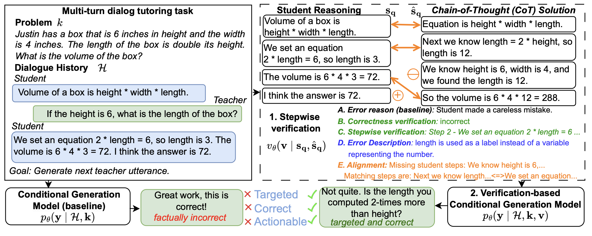

# Stepwise Verification and Remediation of Student Reasoning Errors with Large Language Model Tutors
[](https://arxiv.org/pdf/2407.09136)
[](https://creativecommons.org/licenses/by/4.0/deed.en)
[](https://www.python.org/)

This repository contains dataset and code for the EMNLP 2024 paper **"Stepwise Verification and Remediation of Student Reasoning Errors with Large Language Model Tutors"**.

*Abstract:*
Large language models (LLMs) present an opportunity to scale high-quality personalized education to all. A promising approach towards this means is to build dialog tutoring models that scaffold students' problem-solving. However, even though existing LLMs perform well in solving reasoning questions, they struggle to precisely detect student's errors and tailor their feedback to these errors. Inspired by real-world teaching practice where teachers identify student errors and customize their response based on them, we focus on verifying student solutions and show how grounding to such verification improves the overall quality of tutor response generation. We collect a dataset of 1K stepwise math reasoning chains with the first error step annotated by teachers. We show empirically that finding the mistake in a student solution is challenging for current models. We propose and evaluate several verifiers for detecting these errors.
Using both automatic and human evaluation we show that the student solution verifiers steer the generation model towards highly targeted responses to student errors which are more often correct with less hallucinations compared to existing baselines.

Contact Persons: [Nico Daheim](https://ndaheim.github.io/), [Jakub Macina](https://macina.sk/)

[ETH-LRE](https://lre.inf.ethz.ch/) | [ETH Zurich](https://ethz.ch/en.html) | [UKP Lab](https://www.ukp.tu-darmstadt.de/) | [TU Darmstadt](https://www.tu-darmstadt.de/
)



## Getting Started

The code will be uploaded soon. Once uploaded, it will be possible to install all requirements by using: 
  ```
  pip install -r requirements.txt
  ```
To use GPT models, set up your environmental variable `OPENAI_API_KEY` with valid key.

## Dataset
The dataset will be uploaded to the folder `dataset` shortly. The dataset is an extension of [MathDial](https://github.com/eth-nlped/mathdial) and contains 1k student solutions and their stepwise reasoning chains in the domain of multi-step math problem-solving.

The structure of the dataset is:
- *problem*: Question student is solving.
- *topic*: Short lesson topic description.
- *reference_solution*: Solution to the problem.
- *student_incorrect_solution*: Student incorrect solution.
- *incorrect_index*: Index of the incorrect step in the incorrect student solution.
- *incorrect_step*: The first step with a student mistake as annotated by a teacher.
- *error_category*: Category of the error.
- *error_description*: Description of the error annotated by a teacher. 
- *dialog_history*: Dialogue between teacher and student. The student explains their solution as a part of their response.
- *student_correct_response*: Correct student solution augmented by prompting the model to rephrase a reference solution.


Example:
```json
{
        "problem": "Carl has been selling watermelons on the side of the road for $3 each. This evening he went home with $105 in profit and 18 watermelons. How many watermelons did he start out with this morning?",
        "topic": "Math Word Problem",
        "reference_solution": "Carl sells his watermelons for $3 each so today he sold $105 / $3 per watermelon = 35 watermelons.\nHe had 18 watermelons left over, so this morning he started with 18 + 35 = 53 watermelons.\n 53",
        "student_incorrect_solution": [
            "Let's start by finding out how much money Carl made selling the 18 watermelons. Since he sold each watermelon for $3, he made 18 x $3 = $54.",
            "We know that his total profit for the day was $105, so he must have started with $105 - $54 = $51 worth of watermelons.",
            "Since each watermelon costs $3, he must have started with 51 / $3 = 17 watermelons.",
            " 17"
        ],
        "incorrect_index": 0,
        "incorrect_step": "Let's start by finding out how much money Carl made selling the 18 watermelons. Since he sold each watermelon for $3, he made 18 x $3 = $54.",
        "error_category": "Misunderstanding of a question",
        "error_description": "Carl did not sell 18 watermelons, but 18 watermelons are left unsold.",
        "dialog_history": [
            {
                "text": "hi deandre, talk me through your solution",
                "user": "Teacher"
            },
            {
                "text": "DeAndre: Hi, I started by finding out how much money Carl made selling the 18 watermelons. Since he sold each watermelon for $3, he made 18 x $3 = $54. Then I realized that his total profit for the day was $105, so he must have started with $105 - $54 = $51 worth of watermelons. Since each watermelon costs $3, I concluded that he must have started with 51 / $3 = 17 watermelons.",
                "user": "Student"
            },
            {
                "text": "how much did the watermelons cost and how much money did he come home with?",
                "user": "Teacher"
            }
        ],
        "student_correct_response": "Carl made a profit of $105 by selling watermelons for $3 each. So, he sold a total of $105 / $3 per watermelon = 35 watermelons. If he had 18 watermelons left over, then this morning he started with 18 + 35 = 53 watermelons.",
...
}
```

## Running models & Evaluation
## Verification
Verification step to benchmark the performance of classification-based verifiers. For overall verification (or `overall_verification_with_solution` for setting with solution):
```bash
python verification/error_verification.py --setting overall_verification --model_name gpt3 --top_n_only 10
```
And for stepwise verification (or `stepwise_verification_with_solution` for setting with solution):
```bash
python verification/error_verification.py --setting stepwise_verification --model_name gpt3 --top_n_only 10
```

To evaluate the verification models, use the following command with the `model_id` parameter (in the format `model_setting`), for example:
```bash
python verification/evaluate.py --model_id gpt3_overall_verification
```

## Verification-based Generation
To run different models for verification-based generation, use the following commands.

To run direct generation baseline:
```bash
python verification_based_response/main.py --model_name gpt3 --settings baseline --top_n_only 10
```

To run baseline with error reason:
```bash
python verification_based_response/main.py --model_name gpt3 --verification_model error_reason --settings two_step --top_n_only 10
```

To run error description:
```bash
python verification_based_response/main.py --model_name gpt3 --verification_model error_description --settings two_step --top_n_only 10
```

To run step alignment:
```bash
python verification_based_response/main.py --model_name gpt3 --verification_model step_alignment --settings two_step --top_n_only 10
```

To evaluate the verification-based generation models, use the following command with the `model_outputs_json` parameter set to the json with the model outputs (in the format `dataset_model_verification_settings`), for example:
```bash
python verification_based_response/evaluate.py --model_outputs_json mathdial_gpt3_step_alignment_two_step.json
```

Similarly, for LLM-based judgment, use the following commands:
```bash
python verification_based_response/judge.py --model_outputs_json mathdial_gpt3_step_alignment_two_step.json
```


## Citation
Please cite as:
```bibtex
@inproceedings{daheim2024stepwise,
  title={Stepwise Verification and Remediation of Student Reasoning Errors with Large Language Model Tutors},
  author={Daheim, Nico and Macina, Jakub and Kapur, Manu and Gurevych, Iryna and Sachan, Mrinmaya},
  booktitle = "Proceedings of the 2024 Conference on Empirical Methods in Natural Language Processing",
  month = nov,
  address = "Miami",
  year="2024",
  publisher = "Association for Computational Linguistics",
}
```

## License
This work is licensed under a
[Creative Commons Attribution-ShareAlike 4.0 International License][cc-by-sa].

[cc-by-sa]: http://creativecommons.org/licenses/by-sa/4.0/
[cc-by-sa-shield]: https://img.shields.io/badge/License-CC%20BY--SA%204.0-lightgrey.svg

## Disclaimer
This repository contains experimental software and data and is published for the purpose of giving additional background details on the respective publication.
